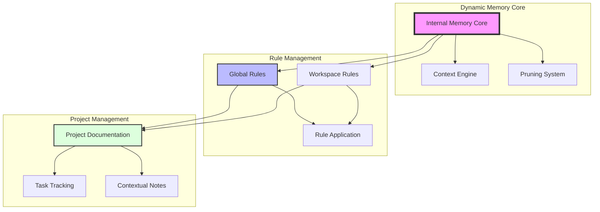
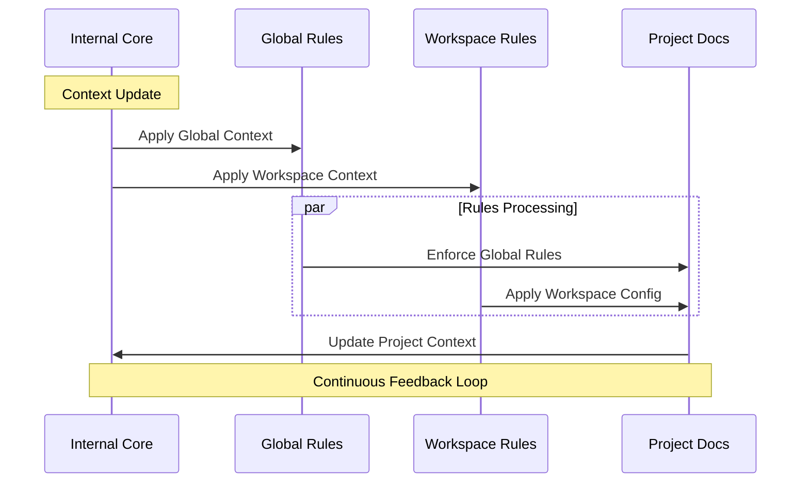
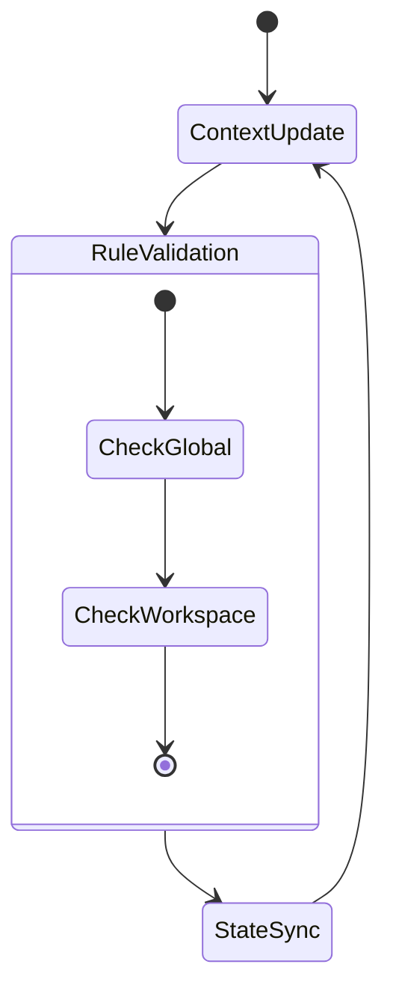
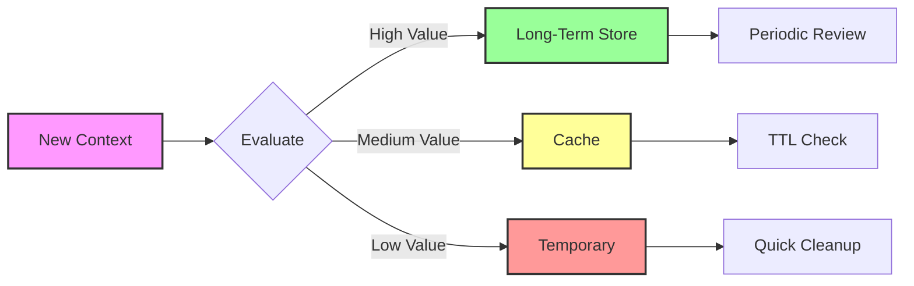
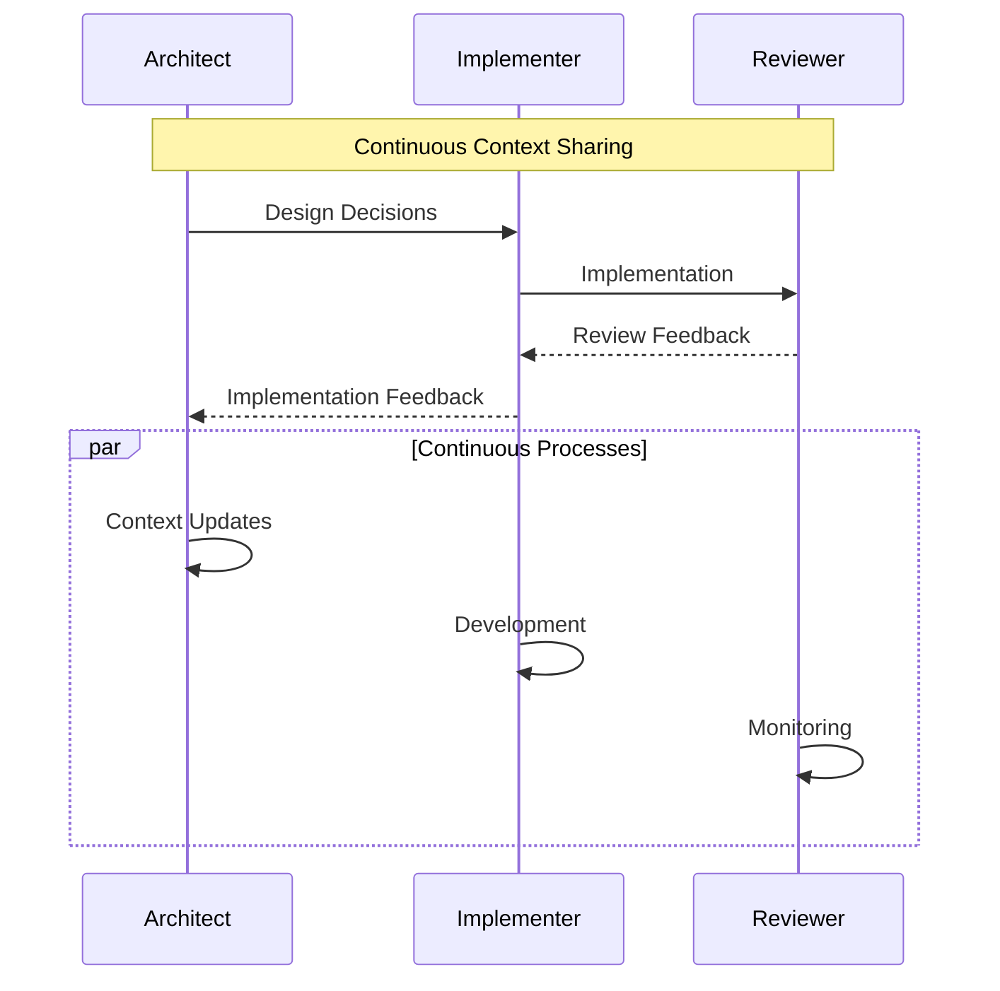
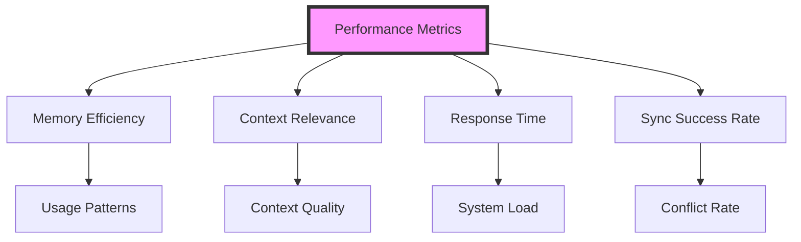
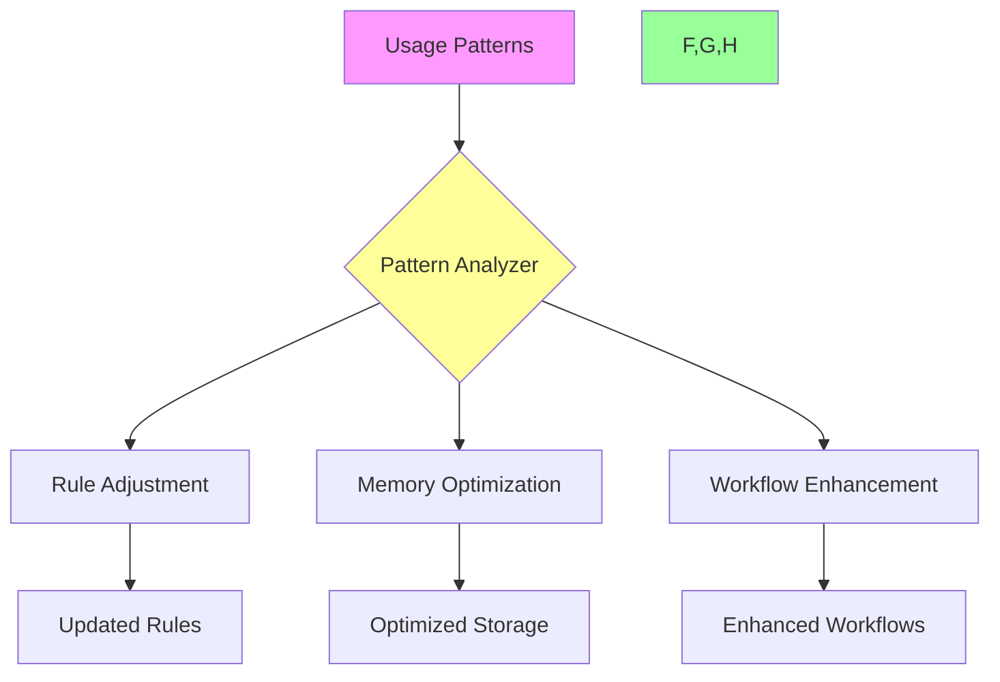

# Cascade Memory Architecture: A Comprehensive Guide
## Parts 1-3: Foundation and Core Concepts

## Introduction
Welcome to the comprehensive guide for Cascade's memory architecture! This guide will help you understand and optimize the various layers of memory that power your development experience. Whether you're new to Cascade or an experienced user looking to maximize efficiency, you'll find practical insights and concrete examples to enhance your workflow.

## 1. Memory Architecture Overview

### Understanding the Big Picture
Cascade's memory system is like a well-orchestrated symphony, where different components work together to maintain context and support your development process. Think of it as a multi-layered system where each layer serves a specific purpose while communicating seamlessly with others.

### Core Architecture Visualization


This diagram illustrates how our memory system is organized into three main segments:
1. **Dynamic Memory Core**: The brain of the system, handling immediate context and decision-making
2. **Rule Management**: The governance layer, ensuring consistent behavior across your development environment
3. **Project Management**: The practical application layer, where your work gets organized and tracked

### How Information Flows


Think of this flow like a continuous conversation between different parts of your brain:
- The Internal Core constantly monitors and updates context
- Global and Workspace Rules act as filters and guidelines
- Project Documentation serves as both the input and output of this process

## 2. Detailed Layer Analysis

### 2.1 Internal Memory Core
Imagine the Internal Memory Core as your development environment's working memory - it's where immediate context lives and decisions are made.

#### What It Does
- Maintains real-time understanding of your current task
- Automatically decides what information to keep or prune
- Connects related pieces of information across your project

#### How It Works
```python
class MemoryCore:
    def store_context(self, context, importance=1.0):
        """Store context with priority-based retention"""
        if self._evaluate_relevance(context) > 0.7:
            self._long_term_store.add(context)
        else:
            self._short_term_cache.add(context, ttl=3600)
    
    def _evaluate_relevance(self, context):
        return (
            context.frequency * 0.4 +
            context.recency * 0.3 +
            context.importance * 0.3
        )
```

This code demonstrates how the system:
- Evaluates the importance of new information
- Decides whether to store information long-term or temporarily
- Uses multiple factors to determine relevance

### 2.2 Global Rules Layer
Think of the Global Rules Layer as the constitution of your development environment - it sets fundamental principles that govern everything else.

#### Key Aspects
- Defines system-wide behaviors and constraints
- Manages priority levels for different types of information
- Ensures consistency across your entire development process

#### Configuration Example
```yaml
global_rules:
  memory_management:
    pruning_threshold: 0.65
    context_retention:
      high_priority: 168h  # 1 week
      medium_priority: 24h
      low_priority: 1h
    
  workspace_coordination:
    sync_interval: 300s
    conflict_resolution: "priority_based"
```

This configuration shows how you can:
- Set retention periods for different priority levels
- Define synchronization intervals
- Establish conflict resolution strategies

### 2.3 Workspace Rules
Workspace Rules are like local laws that apply to specific development environments or instances.

#### Practical Application
```javascript
// .windsurfrules example
{
  "instance_role": "architecture_specialist",
  "model_config": {
    "type": "sonnet",
    "specialization": ["system_design", "optimization"]
  },
  "coordination": {
    "sync_points": ["major_decisions", "conflicts"],
    "communication_channels": ["direct", "memory_layer"]
  }
}
```

This configuration demonstrates:
- How to specialize instances for specific tasks
- Setting up communication channels
- Defining synchronization points

## 3. Layer Interaction Patterns

### 3.1 How Layers Work Together
Just as your brain coordinates different types of memory and thought processes, Cascade's layers work together in sophisticated patterns.

#### Vertical Flow
Information moves up and down through layers like an elevator:
- Context changes trigger rule evaluations
- Rule applications affect project state
- Project changes update context

#### Horizontal Flow
Information also moves sideways within layers:
- Multiple instances share context
- Rules stay synchronized
- Project state remains consistent

### 3.2 Synchronization Patterns


This diagram shows the continuous cycle of:
1. Updating context based on your work
2. Validating against rules
3. Synchronizing state across the system
4. Returning to context updates

### 3.3 Handling Conflicts
```python
def resolve_layer_conflict(layer_a, layer_b):
    """Resolve conflicts between memory layers"""
    if layer_a.priority > layer_b.priority:
        return layer_a.state
    elif layer_b.timestamp > layer_a.timestamp:
        return layer_b.state
    else:
        return merge_states(layer_a, layer_b)
```

This code shows how the system:
- Evaluates competing changes
- Considers priority and timing
- Merges changes when appropriate

## Summary
These first three sections lay the groundwork for understanding how Cascade's memory system works. By understanding these core concepts, you're better equipped to optimize your development workflow and make the most of Cascade's capabilities.

Next sections will cover practical optimization strategies, multi-instance workflows, performance monitoring, and advanced topics.

# Cascade Memory Architecture: A Comprehensive Guide
## Parts 4-7: Advanced Concepts and Practical Implementation

## 4. Optimization Strategies

### 4.1 Memory Layer Optimization
Think of Cascade's memory layers as your project's institutional knowledge. Just like how experienced team members retain important context, our memory system needs to be optimized to keep what matters most readily available.

#### Understanding Context Flow


**Color Legend:**
- New Information (Purple)
- Long-term Storage (Green)
- Cache Storage (Yellow)
- Temporary Storage (Red)

#### Implementation Example
```python
class ContextOptimizer:
    def __init__(self):
        self.retention_policies = {
            'critical': {'ttl': None, 'review_interval': '168h'},  # Project requirements, core decisions
            'important': {'ttl': '72h', 'review_interval': '24h'}, # Recent development context
            'routine': {'ttl': '4h', 'review_interval': '1h'}      # Current session details
        }
    
    def optimize_context(self, context_data):
        """Optimize context retention based on importance and usage patterns"""
        importance = self._calculate_importance(context_data)
        policy = self._select_policy(importance)
        return self._apply_retention_policy(context_data, policy)
```

#### Practical Usage Tips
1. Use `critical` retention for:
   - Project requirements
   - Architectural decisions
   - Core business logic
2. Use `important` retention for:
   - Recent code changes
   - Current sprint goals
   - Active discussions
3. Use `routine` retention for:
   - Debug information
   - Temporary variables
   - Session-specific details

### 4.2 Adaptive Learning System
The system learns from your development patterns to optimize memory management. Think of it as a smart assistant that notices which information you frequently need and ensures it's readily available.

```python
class AdaptiveLearning:
    def update_patterns(self, usage_data):
        """Update retention patterns based on actual usage"""
        pattern = {
            'access_frequency': self._calculate_frequency(usage_data),
            'context_lifetime': self._analyze_lifetime(usage_data),
            'relationship_strength': self._measure_relationships(usage_data)
        }
        return self._adjust_retention_rules(pattern)
```

#### Real-World Example
When you frequently reference a particular class while working on related components, the system will:
1. Increase the retention priority of that class's context
2. Maintain relationships between connected components
3. Pre-load relevant documentation and previous changes

## 5. Multi-Instance Workflows

### 5.1 Parallel Processing Patterns
Multiple Cascade instances can work together like a well-coordinated development team. Each instance can specialize in different aspects while maintaining shared context.

```yaml
# specialist_config.yaml
instance_configs:
  architect:
    role: "system_design"
    priority_tasks: ["architecture", "optimization"]
    context_focus: ["project_structure", "dependencies"]
    
  implementer:
    role: "development"
    priority_tasks: ["coding", "testing"]
    context_focus: ["current_feature", "related_components"]
    
  reviewer:
    role: "quality"
    priority_tasks: ["review", "validation"]
    context_focus: ["best_practices", "previous_issues"]
```

### 5.2 Coordination in Action


#### How to Use Multi-Instance Workflows
1. Start with the Architect instance for initial planning
2. Switch to Implementer for coding tasks
3. Use Reviewer for code review and quality checks
4. All instances maintain shared project context

### 5.3 Smart Conflict Resolution
When multiple instances suggest different approaches, the system intelligently resolves conflicts while maintaining context integrity.

```python
class ConflictResolver:
    def resolve_multi_instance_conflict(self, changes):
        """Resolve conflicts between multiple instance changes"""
        weighted_changes = []
        
        for change in changes:
            weight = (
                change.instance_priority * 0.4 +  # Instance role importance
                change.timestamp_recency * 0.3 +  # How recent is the change
                change.context_relevance * 0.3    # Relevance to current task
            )
            weighted_changes.append((weight, change))
        
        return self._merge_changes(sorted(weighted_changes, reverse=True))
```

## 6. Performance Monitoring

### 6.1 Understanding Your Memory System
Monitor these key indicators to ensure optimal context retention:



### 6.2 Smart Monitoring System
```python
class PerformanceMonitor:
    def collect_metrics(self):
        """Gather key performance indicators"""
        return {
            'memory_usage': self._measure_memory_usage(),
            'context_relevance': self._evaluate_context_quality(),
            'response_times': self._calculate_response_times(),
            'sync_success_rate': self._measure_sync_success()
        }
    
    def generate_health_report(self):
        """Create actionable insights from metrics"""
        metrics = self.collect_metrics()
        return {
            'health_score': self._calculate_health_score(metrics),
            'recommendations': self._generate_recommendations(metrics),
            'alerts': self._check_thresholds(metrics)
        }
```

### 6.3 Optimization Settings
```javascript
// performance_config.json
{
  "thresholds": {
    "memory_usage": {
      "warning": 0.75,    // Alert when 75% of optimal capacity reached
      "critical": 0.90    // Take action at 90% capacity
    },
    "context_relevance": {
      "minimum": 0.65     // Maintain at least 65% relevance
    },
    "response_time": {
      "warning_ms": 200,  // Alert if responses exceed 200ms
      "critical_ms": 500  // Critical if exceeding 500ms
    }
  },
  "optimization_rules": {
    "auto_cleanup": true,           // Remove outdated context
    "aggressive_pruning": false,    // Conservative cleanup
    "context_prefetch": true       // Preload likely needed context
  }
}
```

## 7. Advanced Topics

### 7.1 Meta-Language Framework
Our meta-language helps different memory layers communicate effectively, ensuring smooth context flow throughout the system.

```python
class MetaLanguage:
    def encode_message(self, source_layer, target_layer, content):
        """Encode a message for inter-layer communication"""
        return {
            'meta': {
                'source': source_layer,
                'target': target_layer,
                'timestamp': time.time(),
                'protocol_version': '1.0'
            },
            'content': self._encode_content(content),
            'validation': self._generate_checksum(content)
        }
```

### 7.2 Continuous Improvement System


### 7.3 Quick Start Templates

#### Basic Configuration
```yaml
memory_config:
  default_retention:
    project_context: "permanent"
    session_context: "24h"
    temp_context: "1h"
  
  optimization:
    auto_cleanup: true
    context_sharing: true
    pattern_learning: true
```

## Summary
Remember these key points for optimal memory usage:
1. Configure retention policies based on your project's needs
2. Use multi-instance workflows for complex tasks
3. Monitor performance metrics regularly
4. Start with basic configurations and adjust as needed

The power of Cascade's memory system comes from its ability to maintain relevant context while adapting to your development patterns. Use these tools and patterns to enhance your productivity and maintain project coherence across all development phases.
