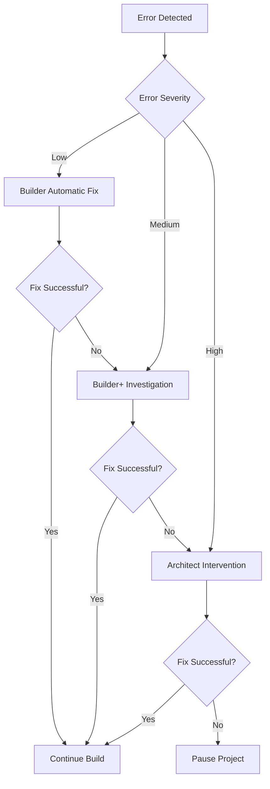
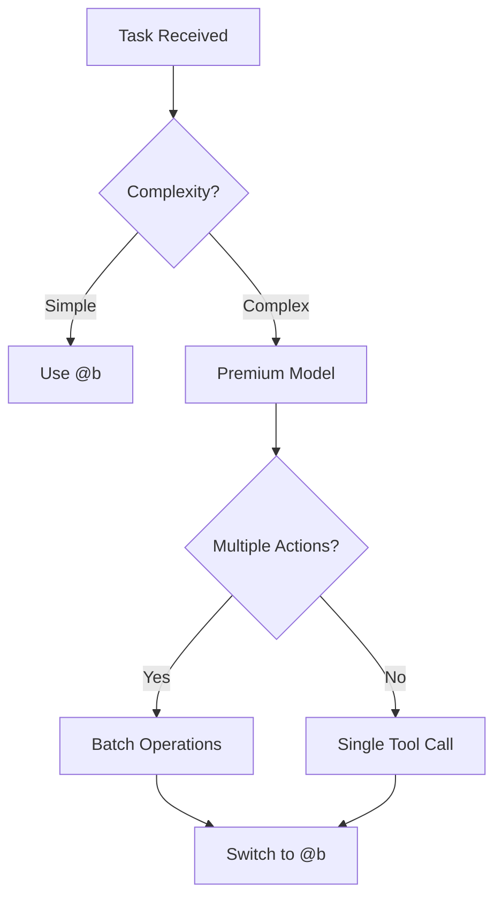
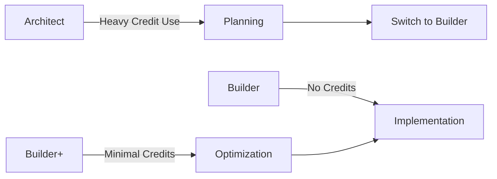

# WindFlow Framework Specification v1.0

## 1. Overview

### Purpose
This specification defines the comprehensive Plan-Build-Fix (PBF) framework for WindFlow, establishing a systematic approach to project development and AI-assisted coding.

### Key Principles
- Recursive, iterative workflow
- Minimal user intervention
- Clear role definitions
- Efficient model switching
- Continuous improvement

### Framework Components
- State-driven development cycle
- Explicit role responsibilities
- Standardized command structure
- Advanced error handling
- Progress tracking mechanisms

## 2. State Diagram

```mermaid
graph TD
    A[User Input] --> B[Plan Phase]
    B --> |[plans]| C[Architecture Review]
    C --> |[directs/clarifies]| D[Build Phase]
    D --> |[creates/edits]| E[Implementation]
    E --> |[tests]| F{Tests Pass?}
    F --> |No| G[Fix Phase]
    G --> |[fixes]| H{Fix Successful?}
    H --> |Yes| E
    H --> |No| B
    F --> |Yes| I[User Review]
    I --> |[reviews]| J{Approved?}
    J --> |Yes| K[Next Task]
    J --> |No| L[Diagnose]
    L --> |[diagnoses]| B
```

## 3. Command Glossary

### User Commands
| Command | Purpose | Example | Typical Use Case |
|---------|---------|---------|-----------------|
| [directs] | Provide initial requirements or goals | "Create a web app for task tracking" | Project initialization |
| [clarifies] | Request additional details or context | "What tech stack should we use?" | Resolving ambiguities |
| [reviews] | Validate implementation or progress | "Check the current UI design" | Quality assurance |
| [diagnoses] | Identify deeper issues | "The authentication seems problematic" | Error investigation |

### AI Commands
| Command | Purpose | Example | Typical Use Case |
|---------|---------|---------|-----------------|
| [plans] | Develop comprehensive strategy | "Generate project architecture" | Initial project setup |
| [creates] | Generate new code components | "Implement user registration" | Code development |
| [edits] | Modify existing code | "Refactor authentication module" | Code improvement |
| [tests] | Validate code functionality | "Run comprehensive test suite" | Quality verification |
| [fixes] | Correct identified issues | "Resolve authentication bug" | Error correction |

## 4. Role Definitions

### Architect Role
- **Models:** @s/@o/@g/@dr
- **Responsibilities:**
  - Comprehensive project planning
  - Requirements analysis
  - Strategic decision-making
  - High-level design architecture
- **Entry Conditions:**
  - Unclear project requirements
  - Complex system design needed
- **Exit Conditions:**
  - Detailed project plan created
  - User approval obtained

### Builder Role
- **Model:** @b
- **Responsibilities:**
  - Code implementation
  - Basic testing and validation
  - Progress logging
  - Following architectural guidelines
- **Entry Conditions:**
  - Approved project plan
  - Clear implementation instructions
- **Exit Conditions:**
  - Functional code segment
  - Passes initial tests
  - Ready for review

### Builder+ Role
- **Model:** @d
- **Responsibilities:**
  - Complex implementations
  - Advanced error resolution
  - Performance optimization
  - Handling edge cases
- **Entry Conditions:**
  - Standard builder encounters complex issue
  - Performance bottlenecks detected
- **Exit Conditions:**
  - Optimized code
  - Resolved complex issues
  - Enhanced performance

## 5. Error Handling Decision Tree


## 6. Progress Tracking Schema

### Status Indicators
| Emoji | Meaning | Description |
|-------|---------|-------------|
| ✅ | Complete | Task fully implemented and verified |
| ⚒️ | In Progress | Active development or debugging |
| ⏹️ | Not Started | Planned but not yet begun |
| 💡 | Enhancement | Potential improvement identified |
| 🐛 | Bug | Known issue requiring resolution |

### Session File Structure
```markdown
# Session: YYYY-MM-DD

## Project Context
- Name: 
- Current Phase: 
- Active Role: 

## Progress Tracking
- [ ] Task 1 ⏹️
- [x] Task 2 ✅
- [ ] Task 3 ⚒️

## Detailed Logs
- [Timestamp] [Role] [Action] [Status]
- 2025-02-03 10:15 @b [creates] User Registration Module ⚒️
```

## 7. Transition Triggers

### Phase Transitions
| From Phase | To Phase | Primary Trigger | Secondary Trigger | Approval Required |
|------------|----------|----------------|------------------|-------------------|
| Plan | Build | Architect completes plan | User [directs] | User [reviews] |
| Build | Fix | Test failures detected | Performance issues | Automatic |
| Fix | Build | Successful error correction | Performance improvement | Automatic |
| Fix | Plan | Persistent complex issues | Architectural limitations | Architect review |

### Role Transitions
| From Role | To Role | Transition Conditions | Handoff Requirements |
|-----------|---------|----------------------|----------------------|
| Architect | Builder | Detailed plan created | Comprehensive documentation |
| Builder | Builder+ | Complex issue detected | Performance metrics |
| Builder+ | Architect | Unresolvable issue | Detailed problem report |

## 8. Implementation Areas

### 4.1 Error Recovery Protocols
#### Error Pattern Recognition
- Categorize errors by source and impact
- Map common error patterns to resolution strategies
- Track error frequency and resolution success rates

#### Recovery Procedures
- Immediate mitigation steps
- Fallback mechanisms
- Data preservation protocols
- State recovery processes

#### Post-Recovery Analysis
- Root cause identification
- Prevention strategies
- Documentation requirements
- Knowledge base updates

### 4.2 Dependency Management
#### Component Dependencies
- Version compatibility matrix
- Update procedures
- Conflict resolution
- Integration testing requirements

#### Environment Configuration
- Setup prerequisites
- Configuration validation
- Environment variables
- Resource requirements

### 4.3 FAC Tracking Implementation
#### Action Classification
- Tool operation costs
- Compound action handling
- Optimization opportunities
- Resource allocation strategies

#### Tracking Mechanisms
- Usage logging format
- Reporting templates
- Validation procedures
- Optimization metrics

### 4.4 Model Interaction Workflows
#### Transition Triggers
- Task complexity assessment
- Resource availability checks
- Performance thresholds
- Context preservation requirements

#### Handoff Protocols
- State transfer procedures
- Context maintenance
- Progress tracking
- Recovery points

### 4.5 Confidence Level Framework
#### Level Definitions
- Confidence metrics
- Assessment criteria
- Validation requirements
- Adjustment triggers

#### Implementation Impact
- Resource allocation
- Testing requirements
- Documentation standards
- Review processes

## 9. Integration Points

### Tool Integration Strategies
- **Windsurf Memory:**
  - Context retention across sessions
  - Storing design decisions
  - Tracking historical project evolution

- **Cursor Integration:**
  - Precise code navigation
  - Diff tracking
  - Contextual code understanding

- **Cline/Roo Coordination:**
  - Multi-agent task distribution
  - Advanced error analysis
  - Specialized model invocation

### FAC Optimization
- Dynamic model selection based on task complexity
- Minimal premium model usage
- Detailed usage tracking and reporting
- Cost-efficiency algorithms

## 10. Implementation Guidelines

### Best Practices
- Always start in @b mode
- Escalate to premium models only when necessary
- Maintain clear, concise documentation
- Prioritize code readability

### Common Patterns
- Modular code design
- Comprehensive error handling
- Performance-conscious implementations

### Anti-Patterns to Avoid
- Unnecessary model switching
- Over-engineering solutions
- Ignoring performance implications
- Incomplete documentation

## 11. Flow Action Credit System

### Tool Call Mapping
Each tool call maps directly to 1 Flow Action credit when using premium models:
- 🔍 Search operations (codebase, grep, find)
- 📖 View operations (file, code item)
- ✏️ Edit operations (propose, create)
- 🖥️ Terminal commands
- 🌐 Web operations (search, read)

### Credit Optimization Strategies



### Role-Based Credit Management



### PBF Framework Credit Flow

```mermaid
graph TD
    A[Plan Phase] -->|Multiple Credits| B[Analysis Complete]
    B --> C[Build Phase]
    C -->|@b Operations| D[Implementation]
    D --> E{Issues?}
    E -->|Yes| F[Fix Phase]
    F -->|Targeted Credits| G[Resolution]
    G --> D
    E -->|No| H[Complete]
```

## 12. Continuous Improvement

### Feedback Mechanism
- Regular review of framework effectiveness
- User input collection
- Performance metric analysis

### Iteration Strategy
- Quarterly framework review
- Incremental improvements
- Adaptation to emerging technologies

*Version 1.0 - Last Updated: 2025-02-03*
